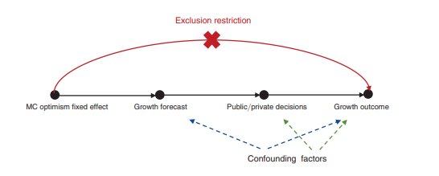

```{r setup, include=FALSE}
knitr::opts_chunk$set(echo = TRUE)
library(tidyverse)
library(ggplot2)
library(janitor)
library(datasauRus)
library(haven)
library(stringr)
library(patchwork)

```

```{=tex}
\begin{centering}

{\bf Abstract}
\\

Inaccurate forecasting, even if used to increase consumer confidence, seems to create catastrophic long-term results. By analyzing once-booming economies which experienced such catastrophes based on data provided by the IMF, we reach a conclusion that verifies just that; disproportionate, positive economic expectations are a precursor to economic collapse. Baseless yet optimistic forecasts made by private entities tend to yield similar results; overt optimism in forecasts may or may not facilitate short-term booms, but they do tend to wreck long-term havoc. 

\end{centering}
```
# Introduction

Effective monetary policy requires the use of accurate forecasting. However, statistical evidence seems to demonstrate that these two phenomenon are related in more than just one causal manner (Pigou 1927). By comparing forecasted and actual real Gross Domestic Product growth rates and exploring their causal relationship, this hypothesis can be put to the test. While Beaudry and Willems (2021) do an excellent job at testing this hypothesis, their conclusion are derived from the somewhat inaccurate model that presupposes post-inaccurate excessive optimism for the long-term results they conclude are caused. This convoluted phenomenon is described in sufficient detail later in this paper.

```{r, include=FALSE}
c1 <- readxl::read_excel("./data/tableC1_bw.xlsx", "data")

data_bw <- read_dta("data/data_bw.dta")

```

# What the data shows

The IMF produces bi-annual economic reports for all member countries (IMF 1990--2018) which is inclusive of data from similar research bodies. What makes this source of data unique is that it covers 189 states, making it possible to create cumulative reports based on the global economy and establish trends backed by an enormous amount of data.

## A Cycle of Deception



Baseless optimism leads to increased consumer confidence. This leads to increase debt accumulation. These two phenomenon create a positive feedback loop, often resulting in short-term economic gains. The latter makes economies less resilient in the long-term.

## What makes Beaudry and Willems (2021) Almost Accurate

To measure forecasting errors, we will subtract the predicted annual real GDP growth and the actual annual real GDP growth rate for every year and for periods of up to four years. The IMF predicts Gross Domestic Product growth rates over one, two, three and four year periods.The equation used in Beadry and Willems (2002) uses the following equation to calculate for their "subtract the actual from the predicted" approach:

$F_{cht} = (1/h) ( \sum_{j=1}^h (g_{c,t+j|t}^f - g_{c,t+j})) (1)$

where c is the country, j the time period and t the year. The predicted growth is represented by $g_{c,t+f|t}$. The actual growth by $g_{c,t+f|t}^f$. The sum of their difference is divided by the number of periods they cover. While this is an interesting concept, it has one major flaw; **it calculates mean precision of h prior time periods worth of forecasts.**

Here are visualizations for their forecast errors for one and three year terms respectively from the years 1990 to 2016:

```{r}

data_bw |>
  ggplot(mapping = aes(x = year, y = yr1_fe, color = yr1_fe)) +
  geom_point()+
  theme_minimal()+
  labs(
    x = "Year",
    y = "Forecast Error",
    color = "One-Year Forecast Error",
    caption = "Forecast error using equation (1) "
  ) 


```
```{r}
data_bw |>
  ggplot(mapping = aes(x = year, y = yr3_fe, color = yr3_fe)) +
  geom_point()+
  theme_classic()+
  labs(
    x = "Year",
    y = "Forecast Error",
    color = "Three-Year Forecast Error",

    caption = "Forecast error using equation (1) "
  )


```
Both of these demonstrate how this method becomes even more inaccurate over longer time periods. 

Furthermore, the pre-reported inaccurate false optimism isn't  even considered, so the interdependence of the two is not evaluated. 

Their approach does not compare the most relevant variables, and produces an inaccurate result which exaggerates reality. In the following section, it is described how this reproduction of Beaudry and Willems (2021) asks the same question, yet uses a better methodology to produce more accurate results.

The following diagram maps these two forecasts against the actual Real Gross Domestic Product per capita growth achieved in these respective years.

```{r}
data_bw |>
  ggplot(mapping = aes(x= year)) +
  geom_point(aes(y = rgdp_gr, color = "Real GDP Growth Rate"))+
  geom_point(aes( y = yr1_fe, color = "One-year forecast error")) +
  geom_point(aes( y = yr3_fe, color = "Three-year forecast error"))+
  
  theme_classic()+
  labs(
    x = "Year",
    y = "Forecast Error",
    color = "Legend",

    caption = "Forecast error using equation (1) "
  )


```
Developing countries almost always have very unpredictable, and usually very high real Gross Domestic Product per capita growth rates (Blomstrom, M., Lipsey, R.E. and Zejan, M., 1994.)

To make visualization easier, the following graph excludes countries with a real Gross Domestic Product per capita of under twenty-five thousand dollars.

```{r}

adjusted_data_bw_developed <- data_bw %>%
  select(year, yr1_fe, yr3_fe, rgdp_gr, rgdpch) %>%
    filter(between(rgdpch, 25000,9999999999))

adjusted_data_bw_developed |>
  ggplot(mapping = aes(x= year)) +
  geom_point(aes(y = rgdp_gr, color = "Real GDP Growth Rate"))+
  geom_point(aes( y = yr1_fe, color = "One-year forecast error")) +
  geom_point(aes( y = yr3_fe, color = "Three-year forecast error"))+
  
  theme_classic()+
  labs(
    x = "Year",
    y = "Forecast Error",
    color = "Legend",

    caption = "Forecast error using equation (1) "
  )
```
This scatterplot is exclusively for countries with a real Gross Domestic Product of under twenty-five thousand dollars:
```{r}

adjusted_data_bw_developing <- data_bw %>%
  select(year, yr1_fe, yr3_fe, rgdp_gr, rgdpch) %>%
    filter(between(rgdpch, 0,25000))

adjusted_data_bw_developing |>
  ggplot(mapping = aes(x= year)) +
  geom_point(aes(y = rgdp_gr, color = "Real GDP Growth Rate"))+
  geom_point(aes( y = yr1_fe, color = "One-year forecast error")) +
  geom_point(aes( y = yr3_fe, color = "Three-year forecast error"))+
  
  theme_classic()+
  labs(
    x = "Year",
    y = "Forecast Error",
    color = "Legend",

    caption = "Forecast error using equation (1) "
  )
```

## How Beaudry and Willems' (2021) mistake can be rectified; How to make this reproduction more accurate

Lets take a look at the following equation used by Beaudry and Willem's (2021):

$E_{cht} = (1/h)(\sum_{j=1}^h (g_{c,t - j + 1} - g_{c.t - j + 1|t - h}^f ))$

Simplifying for average growth over h years for country c, we get:

$(1/h)(\sum_{j=1}^h e_{c,t - j +1|t -h})$

Since the premise of this reproduction is improving accuracy, we replace comparing the averages of forecasting errors with the individual elements of $E_{cht}$.

Using this, the forecasts for one and three year periods can be recomputed.

```{r}
hist_rgdpgrowth <- read_excel("data/WEOhistorical.xlsx", sheet = "ngdp_rpch")
prerev_data_bw <- data_bw %>%
  select(rgdp_gr,yr1_fe,yr3_fe)
imf_data <- read_excel("data/imf-dm.xls", sheet = "NGDP_RPCH")
imf_data_diff <- read_excel("data/WEOhistorical.xlsx", sheet = "bca_gdp_bp6")
processed_imf_data_stage1 <- imf_data[2:48]
processed_imf_data_stage2 <- as.data.frame(t(processed_imf_data_stage1))
null_entries_processed_imf_data_stage2 <- processed_imf_data_stage2 %>%
  count("no data")

length(imf_data_diff)
```


# Citations

Beaudry, Paul, and Franck Portier. 2004. "An Exploration into Pigou's Theory of Cycles." Journal of Monetary Economics 51 (6): 1183--1216. 

Beaudry, Paul, and Tim Willems. 2022. "On the Macroeconomic Consequences of Over-Optimism." American Economic Journal: Macroeconomics, 14 (1): 38-59.

Blomstrom, M., Lipsey, R.E. and Zejan, M., 1994. What explains the growth of developing countries?. Convergence of productivity: Cross-national studies and historical evidence, pp.243-259.

SAIS Bologna Center, Johns Hopkins University. christopher.gilbert@jhu.edu . Comment dated 19
January 2022.


# Links

DOI: "<https://www.socialsciencereproduction.org/reproductions/936ea80f-8424-4d77-a098-00a12b7c9f94/index>" Github: "<https://github.com/yfuoft/p2.git>"
